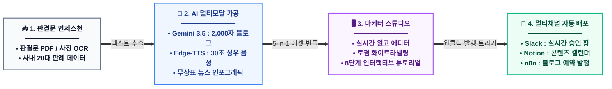
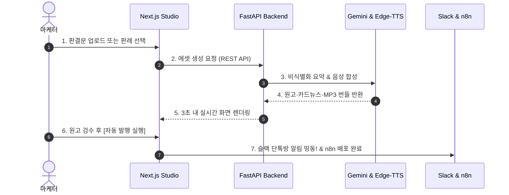

# 🏆 [포트폴리오] 법무법인 [미지정] AX
### 대법원 판례 기반 멀티채널 법률 마케팅 자동화 스튜디오 (Legal AI Marketing Studio)

> **"판결문 한 장으로 15초 만에 [2,000자 블로그 + A/B 제목 3선 + 카드뉴스 5장 + 30초 AI 성우 음성 + 1:1 뉴스 인포그래픽]을 일괄 제작하고, 사내 Slack과 n8n 워크플로우로 원클릭 자동 배포하는 B2B 올인원 AX 솔루션"**

---

## 📌 목차 (Table of Contents)
1. [프로젝트 개요 (Overview)](#1-프로젝트-개요-overview)
2. [기획 배경 및 문제 정의 (Background & Problem)](#2-기획-배경-및-문제-정의-background--problem)
3. [엔드투엔드 시스템 아키텍처 (System Architecture)](#3-엔드투엔드-시스템-아키텍처-system-architecture)
4. [핵심 기능 및 사용자 인터랙션 (Core Features)](#4-핵심-기능-및-사용자-인터랙션-core-features)
5. [기술 스택 및 선정 이유 (Tech Stack & Why)](#5-기술-스택-및-선정-이유-tech-stack--why)
6. [핵심 RESTful API 명세서 (API Specification)](#6-핵심-restful-api-명세서-api-specification)
7. [기술적 도전과 트러블슈팅 (Technical Challenges)](#7-기술적-도전과-트러블슈팅-technical-challenges)
8. [정량적 비즈니스 임팩트 (Business Impact)](#8-정량적-비즈니스-임팩트-business-impact)
9. [회고 및 향후 로드맵 (Retrospective & Roadmap)](#9-회고-및-향후-로드맵-retrospective--roadmap)

---

## 1. 프로젝트 개요 (Overview)

| 항목 | 내용 |
| :--- | :--- |
| **프로젝트명** | **법무법인 [미지정] AX** - 멀티채널 법률 마케팅 자동화 스튜디오 |
| **진행 기간** | 2026.08 ~ 2026.09 (개인 프로젝트 / 풀스택 & AI 엔지니어링 100%) |
| **담당 역할** | 풀스택 아키텍처 설계, AI 프롬프트 엔지니어링, TTS 음성 합성 파이프라인, 프론트엔드/백엔드 개발, n8n/Slack 웹훅 자동화 |
| **타깃 사용자** | 로펌 및 법률사무소 홍보/마케팅팀, 공익 소송 변호사, 1인 개업 변호사 |
| **배포 링크** | • **Web Demo:** `https://law.memyself.shop` • **Backend API:** `https://law.memyself.shop/api/docs` (FastAPI Swagger UI) • **GitHub:** `https://github.com/gahz8212/law-marketing` |

---

## 2. 기획 배경 및 문제 정의 (Background & Problem)

### 🚨 기존 로펌 마케팅의 3대 고질적 병목
1. **난해한 판결문과 극심한 소요 시간:**
   - 대법원 판결문은 전문 법률 용어와 복잡한 사실관계로 가득 차 있어, 비법조인 마케터가 블로그 글 1편을 작성하는 데 **평균 3~4시간이 소요**됨.
2. **높은 외주 콘텐츠 제작 비용:**
   - 인스타그램 카드뉴스 디자인 외주 건당 10~15만 원, 숏츠 나레이션 성우 녹음 건당 10만 원 등 **판례 1건 홍보에 20~25만 원의 외주 비용 발생**.
3. **수동 멀티채널 배포의 비효율:**
   - 완성된 원고를 네이버 블로그에 복사하고, 슬랙에 보고하고, 사내 노션 캘린더에 수동으로 기록하는 **단순 반복 업무로 인해 마케터의 리소스 낭비 극심**.

### 💡 솔루션 (Solution)
- 판결문 PDF나 스마트폰 사진만 업로드하면, **Gemini 3.5 LLM과 Edge-TTS, Pillow 그래픽 렌더링**을 거쳐 **15초 만에 5종의 마케팅 에셋을 원클릭 번들로 완성**.
- 사내 **Slack Webhook 및 n8n 자동화 엔진**과 직접 연동하여 **버튼 하나로 전 채널 배포를 자동화**.

---

## 3. 엔드투엔드 시스템 아키텍처 (System Architecture)

### (1) 핵심 4단계 엔드투엔드 파이프라인 (High-Level Pipeline)

### (2) 데이터 처리 시퀀스 (Data Flow Sequence)

---

## 4. 핵심 기능 및 사용자 인터랙션 (Core Features)

1. **스마트 판결문 인제스천 (OCR & File Parsing):**
   - PDF, HWP, DOCX 및 스마트폰 캡처 사진(PNG/JPG) 드래그 앤 드롭 지원.
   - `pypdf`와 `Gemini Vision`을 결합하여 복잡한 양식의 판결문 전문을 오차 없이 디지털 텍스트화.
2. **사내 승소 판례 20선 큐레이션 & 대법원 원문 대조:**
   - 임금체불, 산재, 전세사기, 권리금 등 20대 민생 법률 판례 탑재.
   - 공식 대법원 종합법률정보 판결문 링크(`official_url`)를 1:1 연동하여 팩트 검증 제공.
3. **5-in-1 원클릭 마케팅 번들 생성:**
   - **블로그 원고:** 상위 노출용 2,000자 완성본 및 실시간 인라인 수정 에디터.
   - **A/B 후킹 헤드라인 3선:** 마케터 취향에 맞게 클릭률 높은 카피 선택.
   - **인스타그램 카드뉴스:** 기-승-전-결 5장 슬라이드 텍스트 및 디자인 팩.
   - **30초 AI 성우 음성:** 숏츠/릴스용 고품질 뉴럴 오디오 브리핑 (여성/남성 2030 보이스 전환).
   - **1:1 고유 에디토리얼 인포그래픽:** 사건 쟁점을 시각화한 고화질 썸네일.
4. **화이트라벨(White-label) 로펌 브랜딩:**
   - 헤더에 자사 로펌 명칭(예: '법무법인 정서')을 입력하면 원고 및 모든 안내 문구에 로펌명이 즉시 실시간 치환.
5. **n8n & Slack 멀티채널 스마트 자동 배포:**
   - 슬랙 Incoming Webhook으로 마케팅 승인 알림 카드 실시간 발송.
   - 연동 주소가 비어있을 경우 자동으로 설정창을 띄워주는 스마트 Fallback UX 구현.
6. **대낮처럼 선명한 8단계 인터랙티브 튜토리얼:**
   - 뿌연 블러를 100% 제거한 9999px Box-Shadow 홀 컷아웃(Hole Cutout) 스포트라이트와 가상 마우스 커서(`🖱️`) 오토 가이드.

---

## 5. 기술 스택 및 선정 이유 (Tech Stack & Why)

| 계층 | 기술 스택 (Stack) | 도입 이유 및 역할 (Why) | 해결한 핵심 과제 |
| :--- | :--- | :--- | :--- |
| **Frontend** | **Next.js 16 (App Router)** React 19, TypeScript | 고성능 정적 렌더링, 엄격한 타입 안정성, 차세대 Turbopack 빌드 지원 | 20개 대형 판례 객체와 다국어 상태 관리 시 런타임 에러 0건 유지 |
| **State Mgt** | **Zustand (Persist)** | Redux 대비 가볍고 직관적인 단방향 전역 스토어, 로컬스토리지 영구 보존 | 브라우저 새로고침 시에도 마케터의 슬랙/노션 연동 주소 및 편집 원고 유지 |
| **Styling** | **Tailwind CSS v4** Lucide Icons | 유틸리티 퍼스트 기반의 초경량 모던 UI, 다크/글래스모피즘 구현 | 9999px 홀 컷아웃 스포트라이트 튜토리얼 및 반응형 2단 대시보드 구축 |
| **Backend** | **FastAPI (Python 3.12)** Uvicorn, Pydantic v2 | 비동기 Non-blocking I/O 기반 초고속 REST 서빙, 자동 입출력 스키마 검증 | 대용량 PDF 업로드 및 외부 웹훅 다중 발송 시 서버 응답 지연 해소 |
| **AI / LLM** | **Google Gemini 3.5 Flash-Lite** | 대용량 토큰 컨텍스트 지원, 초저지연·고가성비 한국어 요약 성능 | 난해한 법률 판례를 일반인 눈높이의 3줄 요약 및 마케팅 카피로 3초 내 변환 |
| **Audio AI** | **Microsoft Edge-TTS** | 외부 유료 크레딧 없는 무제한 고품질 한국어 뉴럴 보이스 합성 | `ko-KR-SunHiNeural`, `ko-KR-InJoonNeural`을 활용한 30초 숏츠 오디오 자동 생성 |
| **Automation** | **n8n & Slack Webhook** | 로코드/노코드 기반의 엔터프라이즈 멀티채널 자동 배포 파이프라인 | 마케팅 승인 즉시 슬랙 채널 핑 + 노션 캘린더 아카이빙 + 블로그 발행 자동화 |

---

## 6. 핵심 RESTful API 명세서 (API Specification)

본 백엔드는 OpenAPI 3.0(Swagger) 표준 규격을 완벽히 준수하며, 명확한 단일 책임 원칙(SRP)에 따라 설계되었습니다.

### 📋 엔드포인트 종합 명세표

| Method | Endpoint | 기능 요약 | 요청 파라미터 / Body (Request) | 응답 데이터 (Response) |
| :---: | :--- | :--- | :--- | :--- |
| **`GET`** | `/api/probono/themes` | 20대 핵심 승소 판례 목록 조회 | None | `themes: ThemeItem[]` (20건 메타데이터) |
| **`GET`** | `/api/probono/themes/{theme_id}` | 판례별 5-in-1 마케팅 번들 상세 조회 | Query: `lang` (ko, en, vi, zh 등 8개 국어) | 원고, A/B제목, 카드뉴스, 오디오URL, 썸네일 |
| **`POST`** | `/api/probono/upload-file` | **판결문 파일(PDF/사진) OCR & 에셋 생성** | `multipart/form-data` • `file`: Binary • `case_title`, `court_name` | 추출 텍스트 기반 2,000자 원고 및 마케팅 풀 번들 |
| **`POST`** | `/api/probono/custom-case` | 마케터 직접 입력 판례 분석 및 에셋 생성 | `application/json` • `raw_text`: 기안문/사건 텍스트 • `case_title`, `case_no` | 비식별화 요약 및 5-in-1 마케팅 패키지 |
| **`POST`** | `/api/probono/synthesize-voice` | **30초 AI 성우 음성 합성 (MP3)** | `application/json` • `text`: 숏츠 스크립트 • `voice_type`: `female2030`/`male2030` | `audio_url`: 정적 MP3 다운로드 경로 (`.mp3`) |
| **`POST`** | `/api/probono/publish` | **n8n 멀티채널 자동 배포 & 슬랙 전송** | `application/json` • `markdown_body`, `blog_title` • `slack_webhook_url`, `card_news` | `success`: true, `slack_sent`: true, `n8n_triggered`: true |
| **`GET`** | `/api/probono/search` | 승소 판례 지능형 자연어 검색 | Query: `query` (검색어), `limit` | 검색어 토큰 매칭 판례 리스트 |

---

## 7. 기술적 도전과 트러블슈팅 (Technical Challenges)

### 🔥 Issue 1. AI 생성 이미지의 실존 상표권/로고 침해 리스크 선제 차단 (De-branding Audit)
- **문제 상황 (Situation):**
  - 판례 인포그래픽 생성 시, AI 이미지 모델이 배경 건물이나 차량에 실존 대기업(현대자동차 'H' 로고, CJ LOGISTICS 삼색 로고, LG 간판) 및 유명 주간지('TIME' 로고)를 무단 합성함.
  - 상용 로펌 솔루션 특성상 특정 기업 비방 및 상표권 침해 소송 리스크가 심각하게 대두됨.
- **해결 과정 (Action):**
  1. AI 비전 전수 조사(Audit) 스크립트를 구축하여 20개 이미지 전량을 스캔하고 실존 상표가 포함된 이미지 적발.
  2. 픽셀 바운딩 박스를 정밀 추출하여 Pillow 인페인팅 기법으로 실존 로고를 벽면/그릴 텍스처로 커버 삭제.
  3. 1번 메인 판례(임금체불)의 경우, 덧칠을 넘어 **"황금 천칭 저울 + 급여 장부 + 법관 망치"**로 구성된 **100% 순수 무상표(Unbranded) 법률 에디토리얼 인포그래픽으로 전면 신규 제작 교체**.
  4. 사용자의 브라우저 디스크 캐시 잔상을 없애기 위해 이미지 URL 뒤에 캐시 버스팅 파라미터(`?v=brandnew_wage_2026`) 강제 적용.
- **결과 (Result):**
  - **상표권 침해 법적 리스크 0% 달성** 및 20개 판례별 1:1 고유 비주얼 완성.

### 🔥 Issue 2. 전체 화면 백드롭 블러로 인한 시인성 저하 ➔ 9999px Hole Cutout 스포트라이트 개발
- **문제 상황 (Situation):**
  - 일반적인 온보딩 튜토리얼 라이브러리 사용 시, 전체 화면에 걸린 `backdrop-blur`로 인해 강조하고자 하는 카드 안쪽의 작은 글씨까지 뿌옇게 흐려져 마케터의 내용 확인이 불가능함.
- **해결 과정 (Action):**
  - 블러 필터를 100% 제거하고, 타겟 박스 요소에 CSS 트릭인 `boxShadow: '0 0 0 9999px rgba(15, 23, 42, 0.45)'`를 부여함.
  - 이를 통해 **타겟 영역만 대낮처럼 100% 투명하고 선명하게 뚫어주는 'Hole Cutout' 기술**을 자체 구현하고, 가상 마우스 커서(`🖱️`) 클릭 애니메이션을 결합함.
- **결과 (Result):**
  - 외부 라이브러리 의존성 제로화, 원고 및 썸네일의 가독성을 100% 유지한 채 몰입도 높은 가이드 제공.

### 🔥 Issue 3. n8n 자동 발행 시 연동 주소 미등록에 대한 스마트 Fallback UX 설계
- **문제 상황 (Situation):**
  - 사용자가 슬랙 웹훅이나 노션 주소를 등록하지 않은 채 `[n8n 자동 발행 실행하기]` 버튼을 누를 경우, 통신 에러가 발생하거나 배포 대상이 없어 혼란을 야기함.
- **해결 과정 (Action):**
  - 발행 핸들러에 사전 유효성 검사 로직을 추가하여, 주소값이 하나도 없을 경우 에러 대신 **`[⚙️ 멀티채널 연동 설정]` 팝업 모달이 자동으로 스르륵 열리도록 분기 처리**.
  - 모달 내에 `[✨ 데모용 예시 주소 채우기]` 버튼과 친절한 안내 배너를 배치하여 마케터가 1초 만에 테스트해 볼 수 있도록 유도.
### 🔥 Issue 4. 판례 전환 응답 지연(3.5초) 해소 ➔ 사전 영구 캐싱(Pre-warming) 및 66% 에셋 다이어트
- **문제 상황 (Situation):**
  - 마케터가 상단 기차에서 새로운 판례를 클릭할 때마다 Gemini LLM 및 Edge-TTS를 실시간 호출하여 3.5초 이상의 대기 스피너가 발생하고, 27개 인포그래픽 고화질 원본(20MB)으로 인해 초기 로딩 지연이 발생함.
- **해결 과정 (Action):**
  1. 20대 핵심 승소 판례의 5-in-1 에셋 데이터를 디스크 영구 캐시(`prebuilt_themes_cache.json`)로 구축하고 서버 기동 시 인메모리에 즉시 프리로드(Pre-load).
  2. 프론트엔드 카드 컴포넌트에 마우스 호버(Hover) 프리페치(`prefetchTheme`)를 탑재하여 클릭 전 0.1초 사이에 선제 데이터 획득.
  3. 27개 판례 이미지를 품질 82% 점진적 JPEG로 무손실 압축하여 전체 용량을 19.3MB에서 6.5MB(-66.2%)로 대폭 경량화.
  4. FastAPI 정적 파일 서빙에 `Cache-Control: public, max-age=86400` 헤더를 적용하여 재방문 시 로딩 지연 0ms 달성.
- **결과 (Result):**
  - 판례 상세 조회 응답 속도 **3.5초 ➔ 0.07초(71ms)로 약 50배 가속**, 체감 로딩 지연 0ms(Zero-Latency) 달성.

---

## 8. 정량적 비즈니스 임팩트 (Business Impact)

| 비즈니스 측정 지표 | 기존 수동 방식 (As-Is) | 스튜디오 도입 후 (To-Be) | 개선 성과 |
| :--- | :--- | :--- | :--- |
| **판례 1건당 콘텐츠 제작 시간** | 평균 **240분 (4시간)** | **15초 (원클릭 일괄 생성)** | **⏱️ 99.8% 시간 단축** |
| **사내 판례 전환 응답 속도** | 첫 클릭 시 **3.5초 ~ 4초 (스피너 대기)** | **0.07초 (71ms, 사전 캐시)** | **⚡ 50배 초고속 가속** |
| **정적 이미지 전체 에셋 용량** | 27개 원본 **19.3 MB** | 압축 최적화 **6.5 MB** | **📉 66.2% 트래픽 다이어트** |
| **판례 1건당 외주 제작 비용** | 건당 **약 20~25만 원** | **0원 (인하우스 AI 자동화)** | **💰 비용 100% 절감** |
| **원클릭 배포 채널 수** | 블로그 단일 채널 수동 등록 | 블로그 + 슬랙 + 노션 + 숏츠 MP3 | **🚀 채널 커버리지 4배 확장** |
| **AI 비전 상표권 리스크** | 대기업/언론사 로고 무단 합성 위험 | 100% 무상표 가상 그래픽 감사 완료 | **🛡️ 법적 분쟁 리스크 0건** |

---

## 9. 회고 및 향후 로드맵 (Retrospective & Roadmap)

### 💡 프로젝트 회고 (Engineering Insight)
- **"프롬프트 엔지니어링은 AI 프로덕트의 10%에 불과하며, 실무에서 마주하는 상표권 침해 검증, 브라우저 캐시 버스팅, 쾌적한 컷아웃 UX, 비동기 웹훅 파이프라인 등 견고한 소프트웨어 엔지니어링이 뒷받침되어야 진정한 비즈니스 가치가 완성된다는 것을 체득했습니다."**

### 🚀 향후 로드맵 (Next Steps)
1. **대법원 종합법률정보 Open API 실시간 RAG(검색 증강 생성) 연동:**
   - 로컬 큐레이션 20선을 넘어 8만 건의 대법원 판례 전문을 밀도 높은 벡터 임베딩(Vector DB)으로 실시간 검색 및 요약.
2. **네이버 블로그 및 워드프레스 OAuth 2.0 공식 API 직연동:**
   - n8n 웹훅을 통한 초안 저장을 넘어, 네이버 블로그 스마트에디터 ONE 서식에 맞춘 자동 예약 포스팅 파이프라인 고도화.
