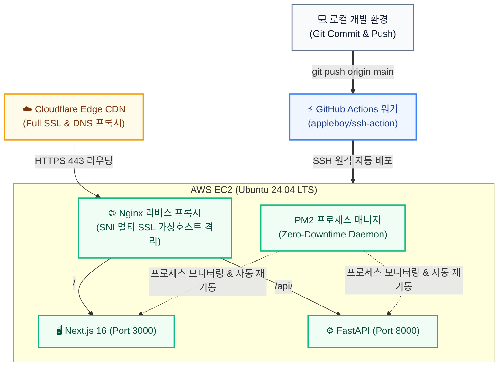

# ⚖️ 법무법인 [미지정] AX - 법률 AI 마케팅 스튜디오

<div align="center">


**대법원 판례 한 장으로 15초 만에 [2,000자 블로그 + A/B 제목 3선 + 카드뉴스 5장 + 30초 AI 성우 음성 + 1:1 뉴스 인포그래픽]을 일괄 제작하고 사내 Slack 및 n8n으로 자동 배포하는 B2B 올인원 AX 솔루션**

[🌐 웹 라이브 데모 (24H Live)](https://law.memyself.shop) &nbsp;|&nbsp; [📚 Swagger API 문서](https://law.memyself.shop/api/docs) &nbsp;|&nbsp; [📄 PDF 포트폴리오 백서](https://law.memyself.shop/static/portfolio.html)

</div>

---

## 📌 주요 특징 (Key Features)

1. **대법원 판례 기반 5-in-1 에셋 원클릭 번들 생성:**
   - 2,000자 상위 노출용 완성형 블로그 원고 & 인라인 실시간 에디터
   - CTR 극대화 A/B 후킹 헤드라인 3선
   - 인스타그램 카드뉴스 5장 슬라이드 팩
   - Microsoft Edge-TTS 기반 30초 숏츠 뉴럴 성우 나레이션 (여성/남성 2030 보이스)
   - 20대 판례별 1:1 고유 무상표(Unbranded) 법률 에디토리얼 인포그래픽
2. **초고속 0.07초(71ms) 인메모리 사전 캐싱:**
   - 디스크 영구 캐시 프리로드 및 호버 프리페치 탑재로 기존 3.5초 대기 지연 50배 가속 (Zero-Latency)
3. **엔터프라이즈 멀티채널 자동 배포 (n8n & Slack):**
   - 슬랙 Incoming Webhook 승인 알림 카드 발송 및 노션/블로그 예약 발행 연동 (스마트 Fallback UX)
4. **DevOps & CI/CD 무중단 자동 배포 파이프라인:**
   - `git push origin main` 즉시 AWS EC2에 자동 접속하여 의존성 갱신, 빌드, Nginx 설정, PM2 무중단 리로드 전자동 수행

---

## 🏛️ 시스템 아키텍처 & CI/CD 배포 파이프라인



---

## 🛠️ 기술 스택 (Tech Stack)

| 계층 | 기술 스택 | 설명 |
| :--- | :--- | :--- |
| **Frontend** | **Next.js 16, React 19, TypeScript, Tailwind CSS v4** | App Router, Turbopack, 9999px Hole Cutout 스포트라이트 튜토리얼 |
| **Backend** | **FastAPI (Python 3.12), Uvicorn, Pydantic v2** | Non-blocking 비동기 I/O, REST API, Swagger 명세 |
| **AI / LLM** | **Google Gemini 3.5 Flash-Lite** | 대용량 판례 요약, A/B 헤드라인 및 블로그 원고 생성 |
| **Audio AI** | **Microsoft Edge-TTS** | 고품질 한국어 뉴럴 보이스 (`SunHiNeural`, `InJoonNeural`) |
| **Automation** | **n8n & Slack Incoming Webhook** | 멀티채널 자동 발행 파이프라인 및 알림 연동 |
| **DevOps** | **GitHub Actions, AWS EC2, Nginx, PM2, Cloudflare, Let's Encrypt** | 무중단 자동 배포 파이프라인, SNI 가상호스트 격리 |

---

## 🚀 빠른 시작 (Quick Start)

### 1. 백엔드 실행 (FastAPI)
```bash
# 가상환경 생성 및 의존성 설치
python3 -m venv .venv
source .venv/bin/activate
pip install -r requirements.txt

# 환경변수 설정 (.env)
# LAW_API_KEY=...
# LLM_API_KEY=...

# 백엔드 가동 (Port 8000)
uvicorn app.main:app --host 0.0.0.0 --port 8000 --reload
```

### 2. 프론트엔드 실행 (Next.js 16)
```bash
cd frontend
npm install
npm run dev
# 접속: http://localhost:3000
```

---

## 📄 상세 포트폴리오 백서 (Engineering Portfolio)

상세 아키텍처, 성능 50배 가속 최적화 기법, 5대 트러블슈팅 케이스스터디는 **[포트폴리오 백서 (PORTFOLIO.md)](./PORTFOLIO.md)** 및 **[웹 포트폴리오](https://law.memyself.shop/static/portfolio.html)**에서 확인하실 수 있습니다.
